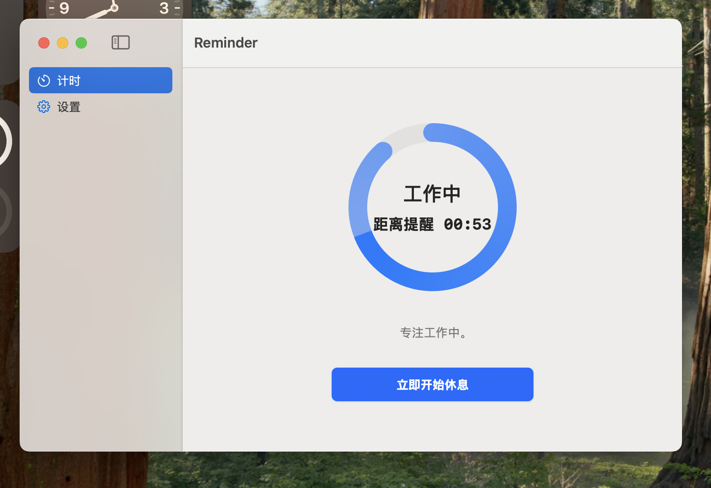
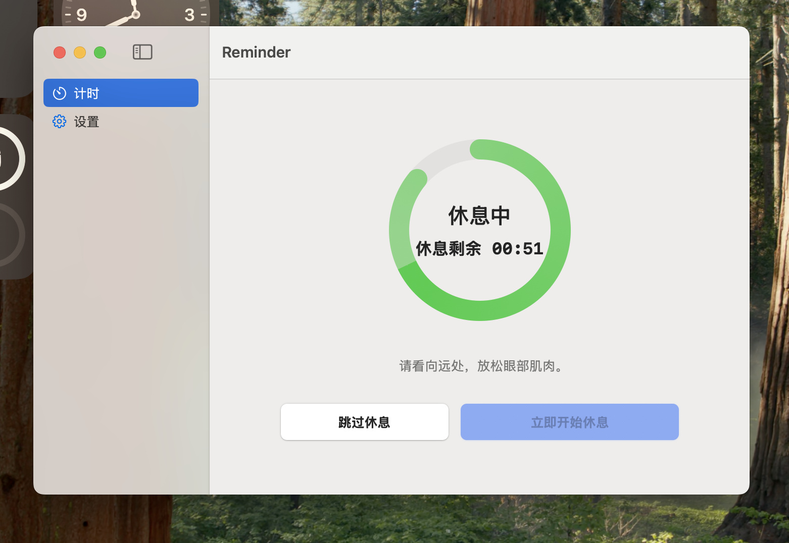
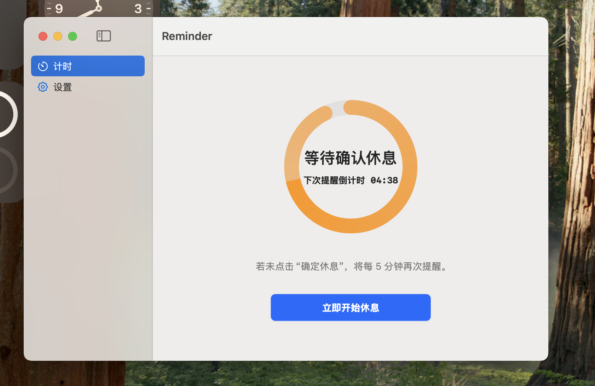
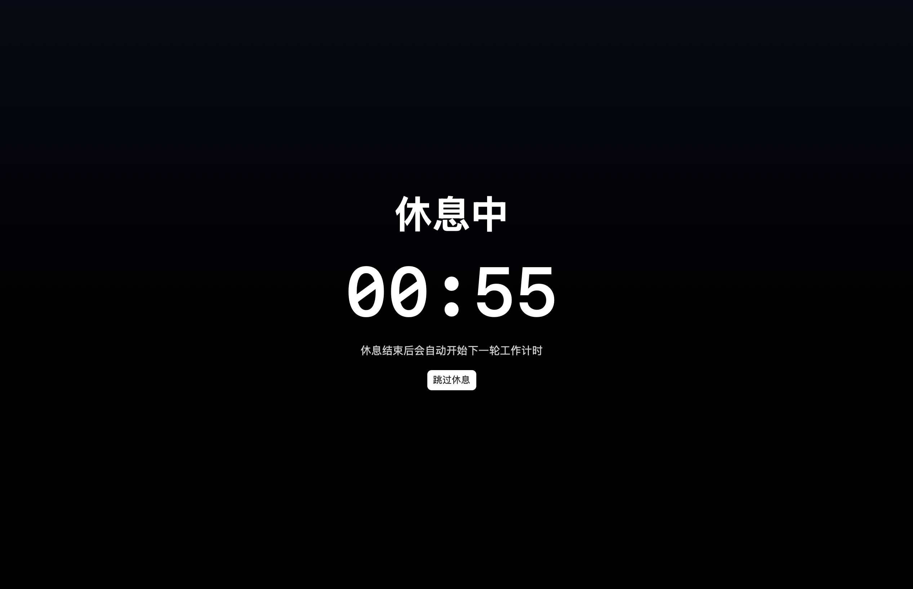

# 👀Reminder


提示您遵循 20-20-20 法则的 macOS 护眼应用。

原生、轻量、高效，占用极小。

## 功能

- 工作提醒间隔可调：默认 `20` 分钟，范围 `5-120` 分钟
- 休息时长可调：默认 `5` 分钟，范围 `1-60` 分钟
- 支持连续滑杆调节 + `±0.5` 分钟精细调节 + 输入框精确输入
- 状态与配置持久化，重启应用后恢复

## 界面预览

<table>
  <tr>
    <td width="50%" align="center">
      <a href="readmeimage/work.png">
        
      </a>
      <br />
      <sub>工作状态</sub>
    </td>
    <td width="50%" align="center">
      <a href="readmeimage/relax.png">
        
      </a>
      <br />
      <sub>休息状态</sub>
    </td>
  </tr>
  <tr>
    <td width="50%" align="center">
      <a href="readmeimage/config.png">
        
      </a>
      <br />
      <sub>参数配置</sub>
    </td>
    <td width="50%" align="center">
      <a href="readmeimage/fullsreen.png">
        
      </a>
      <br />
      <sub>全屏提醒</sub>
    </td>
  </tr>
</table>

## 本地运行

```bash
swift build
swift run Reminder
```

首次运行会请求通知权限。


## 打包为 .app

```bash
./scripts/package_app.sh
```

## 打包为 .dmg

```bash
./scripts/package_dmg.sh
```
